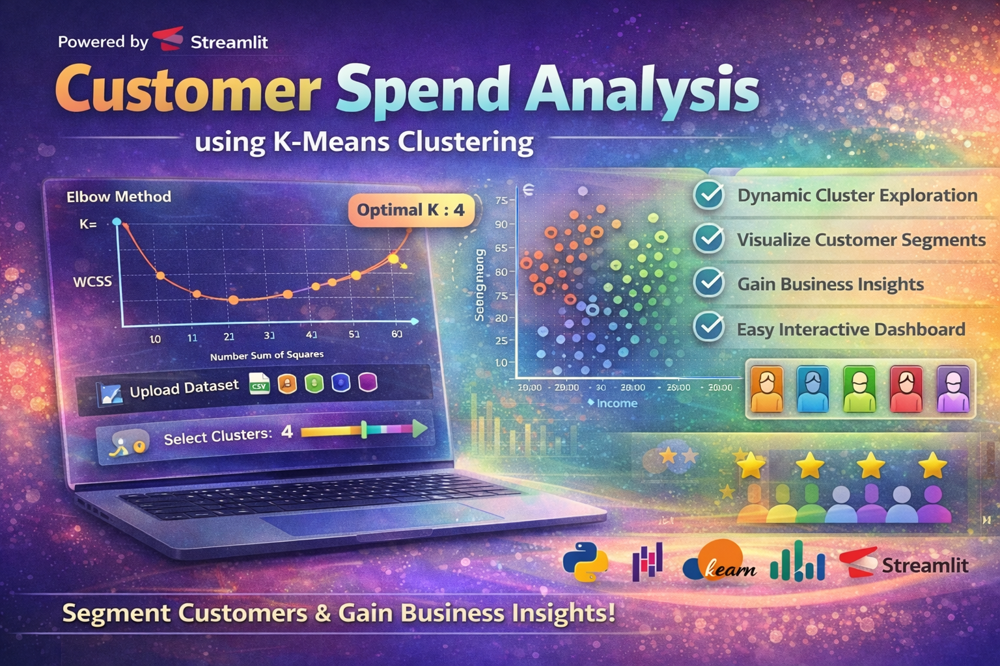

<p align="center">
  
</p>

---

# 📊 Customer Spend Analysis using K-Means Clustering

An interactive Data Science project that segments customers based on their **Income** and **Spending behavior** using the **K-Means Clustering algorithm**. This project helps businesses understand customer groups and make better marketing decisions.

---

## 🚀 Live Features

* 📂 Upload your own dataset (CSV)
* 📈 Elbow Method to find optimal clusters
* 🎯 Interactive cluster selection (K value)
* 📊 Dynamic visualization of customer segments
* 💡 Business insights for decision-making
* 🎨 Clean and attractive Streamlit UI

---

## 🧠 Project Objective

The goal of this project is to:

* Identify different types of customers
* Group customers based on spending patterns
* Help businesses target the right audience
* Improve marketing and sales strategies

---

## 📁 Dataset Requirements

Your dataset must contain the following columns:

* `INCOME` → Customer income
* `SPEND` → Customer spending score

Example:

| INCOME | SPEND |
| ------ | ----- |
| 45     | 60    |
| 70     | 80    |

---

## ⚙️ Technologies Used

* Python 🐍
* Streamlit 🎯
* Pandas 📊
* NumPy 🔢
* Matplotlib 📉
* Scikit-learn 🤖

---

## 📊 Algorithm Used

### K-Means Clustering

K-Means groups data into clusters based on similarity.

Steps:

1. Choose number of clusters (K)
2. Assign data points to nearest centroid
3. Update centroids
4. Repeat until convergence

---

## 📈 Elbow Method

Used to find the optimal number of clusters by plotting:

* X-axis → Number of clusters (K)
* Y-axis → WCSS (Within Cluster Sum of Squares)

---

## 💡 Business Insights

* 🎯 Identify high-value customers
* 💰 Target premium customers effectively
* 📉 Improve low-spending customer engagement
* 📦 Optimize product offerings
* 📢 Personalized marketing strategies

---

## 🖥️ How to Run the Project

### 1️⃣ Install Requirements

```bash
pip install -r requirements.txt
```

### 2️⃣ Run Streamlit App

```bash
streamlit run app.py
```

---

## 📦 requirements.txt

```
streamlit
pandas
numpy
matplotlib
scikit-learn
```

---

## 📸 Output

* Elbow graph for optimal K
* Cluster visualization with centroids
* Interactive dashboard

---

## 🔗 Project Links

* 💻 GitHub Repository: https://github.com/selvan-01/Customer-spent-analysis-using-K-Means-Clustering.git
* 💼 LinkedIn: https://www.linkedin.com/in/senthamil45
* 🌐 Portfolio: https://senthamill.vercel.app/

---

## ⭐ Support

If you like this project:

* ⭐ Star this repository
* 🔁 Share with others
* 💬 Give feedback

---

## 👨‍💻 Author

**S. Senthamil Selvan**
Aspiring AI Developer | AI & Tech Enthusiast 🚀

---
